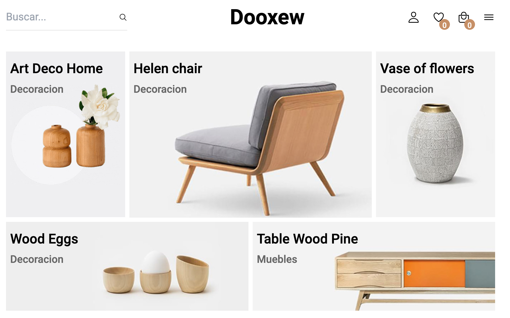
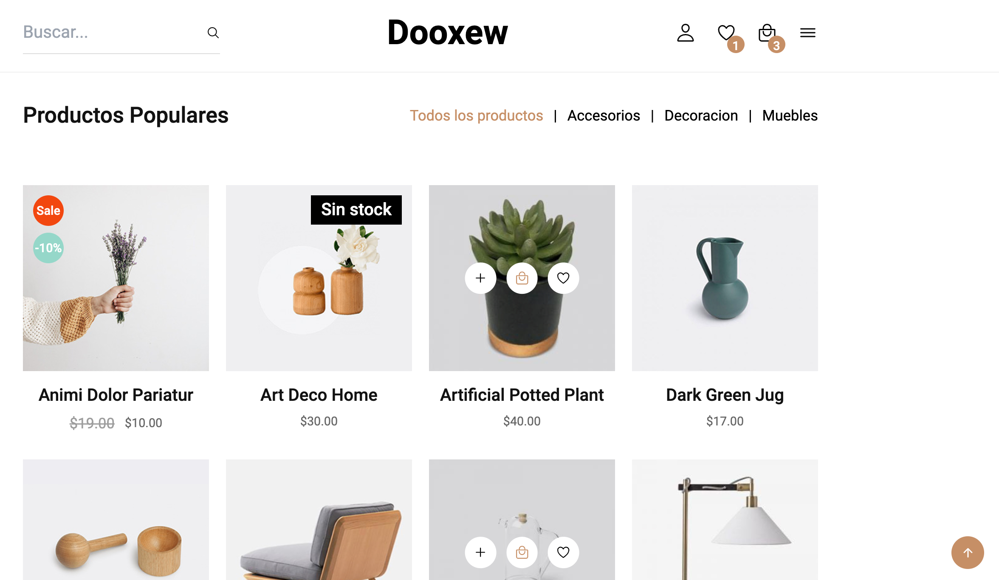
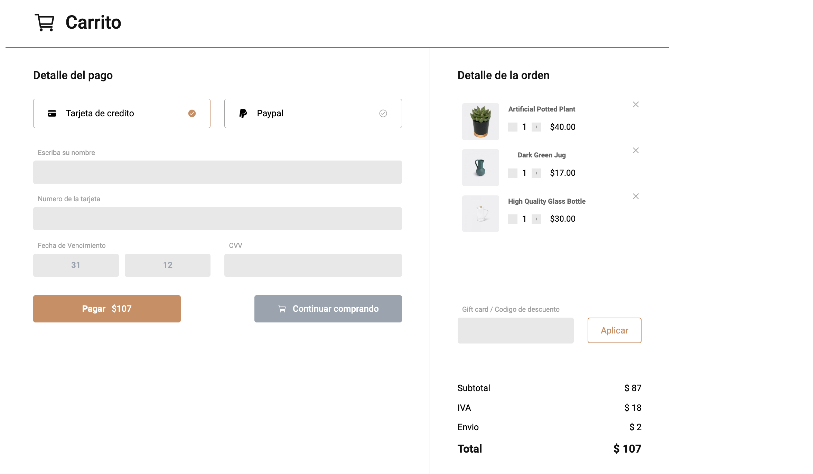

<div align="center">
  
  
  
  
  [](https://twitter.com/intent/follow?screen_name=RSanchez_Eze)
  

  <br />
  <br />

  <h2 align="center">Dooxew - Furniture eCommerce Website</h2>

  Dooxew is a full responsive furniture ecommerce website, <br />Responsive for all devices, build using HTML, SASS, CSS & JavaScript.

  <a href="https://eruedasanchez.github.io/dooxew-ecommerce/"><strong>➥ Live Demo</strong></a>

</div>

<br />

### Demo Screenshots





### Technologies

* [HTML](): Version 5 
* [CSS](): Version 3
* [JavaScript](): Version ES6
* [SASS](): Version 1.62.0
* [Ion Icons](): Version 5.2.3
* [GIT](): Version 2.40


### Prerequisites

Before you begin, ensure you have met the following requirements:

* [Git](https://git-scm.com/downloads "Download Git") must be installed on your operating system.

### Run Locally

To run **Dooxew** locally, run this command on your git bash:

Linux and macOS:

```bash
sudo git clone https://github.com/eruedasanchez/dooxew-ecommerce.git
```

Windows:

```bash
git clone https://github.com/eruedasanchez/dooxew-ecommerce.git
```

### Contact

If you want to contact with me you can reach me at [LinkedIn](https://www.linkedin.com/in/e-ruedasanchez/).

### License

This project is **free to use** and does not contains any license.
